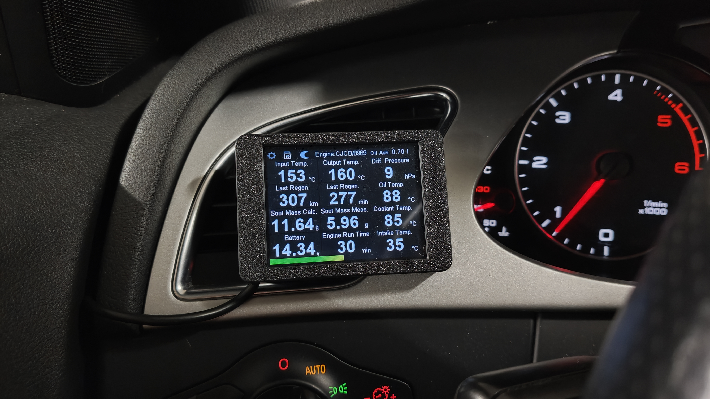

# VAG DPF Monitor

[YouTube](https://youtu.be/WaTfjSRMaVM?si=2cajSNzQjHToZ489)

The __DPF Monitor__ is a compact device designed to monitor the status of the Diesel Particulate Filter (DPF) in VAG group vehicles. The device supports engine controllers with the CAN UDS protocol (4-digit engines starting with Cxxx and Dxxx).

This device provides a real-time view of key parameters, enabling you to consciously manage the DPF regeneration process and prevent costly failures. It's important to remember that monitoring and analyzing these parameters is just as crucial as the regeneration notification itself. With the DPF Monitor, you'll be informed immediately when a regeneration starts, allowing you to avoid interrupting the process.

The device connects to your car via the OBD2 port, and all data is displayed on a dedicated screen. It’s the perfect tool for any driver who wants full control over their DPF's condition.

### Features:
- Readout of engine and DPF parameters
- Audible and visual regeneration notifications on the display
- Logging data to a microSD card
- Regeneration history
- Read and clear engine DTC codes (standard version)
- Quick differential pressure test
- Day/night mode

### Parameter Readouts:
- Engine code and engine controller software number
- DPF inlet and outlet temperatures
- Differential pressure
- Distance since last regeneration (in km)
- Time since last regeneration (in min) (standard version)
- Oil temperature (standard version)
- Calculated soot mass
- Measured soot mass
- Coolant temperature (standard version)
- Battery voltage (standard version)
- Time since engine start
- Intake air temperature (standard version)
- Oil ash residue

### Example of Recorded Logs:

